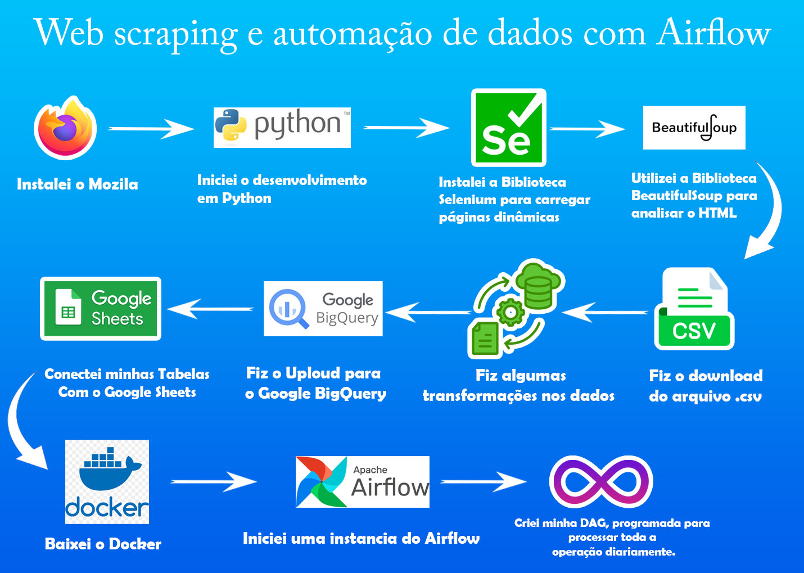

# Projeto: **ETL de Promoções de Vendas Steam - SteamDB**

Bem-vindo ao repositório do **ETL de Promoções Steam - SteamDB**! Este projeto de engenharia de dados automatiza o processo de extração, transformação e carregamento (ETL) de informações sobre promoções disponíveis no site [SteamDB](https://steamdb.info/sales/). Ele organiza e disponibiliza os dados de maneira interativa, armazenando-os no Google BigQuery e conectando-os ao Google Sheets para visualização em tempo real.

## Objetivo do Projeto

Facilitar o acesso a informações atualizadas sobre promoções da Steam, automatizando a coleta de dados, aplicando transformações relevantes e disponibilizando os dados processados em plataformas escaláveis para análises interativas.

## Funcionalidades

- **Web Scraping Automatizado:**
  - Extração de dados diretamente do site [SteamDB](https://steamdb.info/sales/).
  - Armazenamento inicial em uma tabela chamada `steam_sales`.

- **Transformações de Dados:**
  - Processamento e limpeza dos dados extraídos.
  - Criação de uma tabela transformada chamada `data_transform`, com informações otimizadas para análise.

- **Integração com o BigQuery:**
  - Carregamento dos dados transformados para o Google BigQuery.
  - Estruturação para consultas rápidas e escaláveis.

- **Conexão com o Google Sheets:**
  - Sincronização dos dados com o Google Sheets, permitindo análises interativas e acessíveis em tempo real.

- **Automação com Airflow:**
  - Implementação de uma DAG no Apache Airflow utilizando Docker.
  - O pipeline é executado diariamente às 10h da manhã, automatizando todo o processo de ETL.

## Como Funciona o Pipeline

1. **Extração (Extract):**
   - Realiza web scraping no site SteamDB para coletar dados sobre promoções ativas.

2. **Transformação (Transform):**
   - Limpeza e estruturação dos dados extraídos.
   - Criação de novos campos, limpeza de dados nulos e transformação de datas

3. **Carregamento (Load):**
   - Os dados transformados são enviados ao Google BigQuery.
   - Sincronização automática com o Google Sheets para análise e visualização.

4. **Automação com Airflow:**
   - O pipeline está estruturado em uma DAG com as seguintes tarefas:
     - **start_task**: Inicializa o pipeline.
     - **extract_task**: Executa o web scraping para coletar os dados.
     - **transform_task**: Aplica as transformações necessárias.
     - **load_task**: Carrega os dados processados no Google BigQuery.
     - **end_task**: Finaliza o processo.
   - A DAG é configurada para rodar automaticamente todos os dias às 10h da manhã.

## Tecnologias Utilizadas

### Orquestração
- **Apache Airflow**: `apache-airflow==2.7.1`
  - **Providers do Airflow**:
    - `apache-airflow-providers-google==10.0.0` (BigQuery e Google Cloud Storage)
    - `apache-airflow-providers-postgres==5.0.0` (PostgreSQL)
    - `apache-airflow-providers-docker==3.0.0` (Integração com Docker)

### Manipulação de Dados
- **Pandas**: `pandas==2.1.0`
- **PyArrow**: `pyarrow==13.0.0` (para trabalhar com arquivos Parquet)
- **Fastparquet**: `fastparquet==2024.1.0` (alternativa ao PyArrow)

### Google Cloud
- **BigQuery e Storage**:
  - `google-cloud-bigquery==3.12.0`
  - `google-cloud-storage==2.11.0`
- **APIs e Autenticação**:
  - `google-api-python-client==2.95.0`
  - `google-auth==2.24.0`
  - `google-auth-oauthlib==1.2.0`

### Banco de Dados
- **PostgreSQL**: `psycopg2-binary==2.9.7`

### Utilitários
- **Requisições HTTP**: `requests==2.31.0`
- **Gerenciamento de Variáveis de Ambiente**: `python-dotenv==1.0.0`

### Observabilidade (Opcional)
- **Rastreamento de Pipelines**: `openlineage-airflow==0.19.0`

### Desenvolvimento e Depuração
- **Testes Unitários**: `pytest==7.4.2`
- **Formatação de Código**: `black==23.9.1

Com este projeto, garantimos um pipeline eficiente e automatizado para monitoramento de promoções de jogos, centralizando e disponibilizando informações de forma acessível e escalável.
